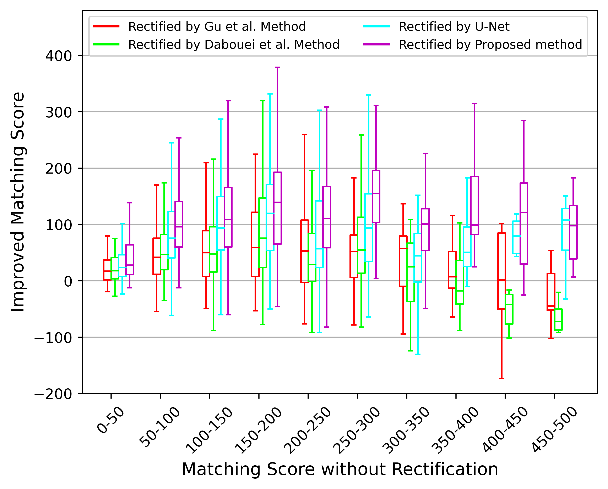

# ChartArtist

**整理一些论文常用的绘图和表格模板**

Novelty 已经很捞了，图表一定要靓啊！

    

 
 

- [曲线](#curves)
  * [分布图](#distribution)
  * [箱线图](#boxplot)
  * [匹配曲线](#matching)
- [表格](#tables)
  * [简单表](#table)
  * [三线表](#threeparttable)

---
## 曲线 
### 分布图 

[概率分布曲线](./functions/draw_KDE.py)

    

 
 

[累积分布曲线](./functions/draw_cumsum.py)

    

 
 

[数值曲线](./functions/draw_line_width_bar.py)

    

 
 

### 箱线图 
[分数提升曲线 (轻量化)](./functions/draw_boxplot_simple.py)

    

 
 

[分数提升曲线](./functions/draw_boxplot.py)

    

 
 

### 匹配曲线 
[DET 曲线](./functions/draw_det.py)

    

 
 

[DET 曲线 (VeriFinger 映射版)](./functions/draw_det_gmsonly.py)

    

 
 

[DET 曲线 (对数坐标)](./functions/draw_det_log.py)

    

 
 

[CMC 曲线](./functions/draw_cmc.py)

    

 
 

---

## 表格 
### 简单表 
[简单表代码](./tex/table/main.tex)

    

 
 

### 三线表 
[三线表代码](./tex/threeparttable/main.tex)

    

 
 